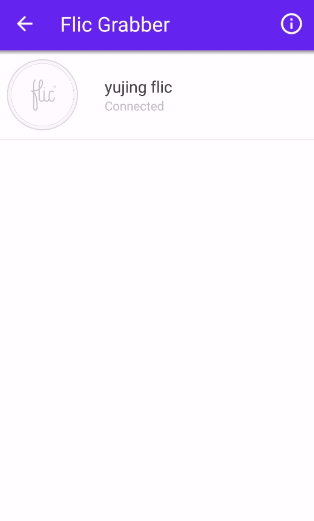

# Android App: the proxy of a Flic button

Let's build an Android application sending [Flic button](https://flic.io/) events to ARTIK Cloud. From there, you can extend the Flic button to control a wide range of remote devices via ARTIK Cloud Rules.

After completing this sample, you will learn how to:
- add a device to ARTIK Cloud programmatically
- proxy the data from a physical device to ARTIK Cloud
- [intercept Flic button events](https://partners.flic.io/partners/developers/android-tutorial)  

## Requirements
- Android Studio
- [ARTIK Cloud Java SDK](https://github.com/artikcloud/artikcloud-java)
- [Flic For Android SDK](https://github.com/50ButtonsEach/fliclib-android)

## Setup / Installation

### Setup at ARTIK Cloud

Follow [these instructions](https://developer.artik.cloud/documentation/tools/web-tools.html#creating-an-application) to create an application. For this Android app, select the following:

 - Under “AUTHORIZATION METHODS”, check “Client credentials, auth code, implicit”.
 - Set “Redirect URL” to cloud.artik.example.flicproxy://oauth2callback .
 - Under “PERMISSIONS”, check “Read” for “Profile”.
Click the “Add Device Type” button. Choose “Example Flic Button” (unique name: cloud.artik.example.flicbutton) as the device type. Check “Read” and “Write” permissions for this device type.

Get the [client ID](https://developer.artik.cloud/documentation/tools/web-tools.html#how-to-find-your-application-id), which you will need later.

### Setup at Flic

Go to [Flic Developer site](https://partners.flic.io/partners/developers/credentials) to create an app. Get the key and secret, which you will need later.

### Setup Android project

 1. Clone this sample repository.
 2. Under the root of the source, clone [Flic Android SDK repository](https://github.com/50ButtonsEach/fliclib-android). This will create directory "fliclib-android" under the root.
 2. In Android Studio, import the sample app Android project. 
  3. Update Config.java file. In this file, replace the placeholders with your own client ID from ARTIK Cloud and the credentials from Flic. You should have obtained them in the previous setup steps.

Now build the project, which will download the ARTIK Cloud SDK JAR from [Maven Central Repository](http://search.maven.org/). Deploy the APK to an Android phone.

## Demo

 1. Launch the app on your Android phone. 

 2. Login using your account.  
   

 3. The app automatically creates a device with type "Example Flic Button" in your ARTIK Cloud account. There are four sections on the screen as the following:  
   
  
  The top section shows ARTIK Cloud device info. The 2nd section will show the physical Flic button's info. Section 3 will show the message sent to ARTIK Clond. The bottom section will print out the response from ARTIK Csloud.

 4. Click "Grab Flic Button", which navigates to the Flic app as blow: 
   
 
 5. Click the button on the Flic Grabber app. This will brings the Flic button to the sample Android app so that the sample app can intercept the button event. Section 2 in the following screen is updated with the name and ID of the physical Flic button: 
   
 
 6. Now you can play with the Flic button. Single click, double click or hold. The app sends a message to ARTIK Cloud for each Flic event. Section 3 prints out the sent message and Section 4 shows the message ID returned by ARTIK Cloud: 

 7. Login to My ARTIK Cloud and see charts of the Flic events as the following: 

## More about ARTIK Cloud

If you are not familiar with ARTIK Cloud, we have extensive documentation at https://developer.artik.cloud/documentation

The full ARTIK Cloud API specification can be found at https://developer.artik.cloud/documentation/api-spec

Check out advanced sample applications at https://developer.artik.cloud/documentation/samples/

To create and manage your services and devices on ARTIK Cloud, create an account at https://developer.artik.cloud

Also see the ARTIK Cloud blog for tutorials, updates, and more: http://artik.io/blog/cloud

## License and Copyright

Licensed under the Apache License. See [LICENSE](LICENSE).

Copyright (c) 2017 Samsung Electronics Co., Ltd.
